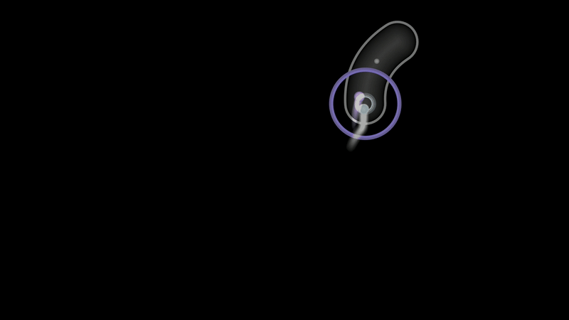

<!-- Improved compatibility of back to top link: See: https://github.com/othneildrew/Best-README-Template/pull/73 -->
<a id="readme-top"></a>
<!--
*** Thanks for checking out the Best-README-Template. If you have a suggestion
*** that would make this better, please fork the repo and create a pull request
*** or simply open an issue with the tag "enhancement".
*** Don't forget to give the project a star!
*** Thanks again! Now go create something AMAZING! :D
-->


<!-- PROJECT SHIELDS -->
<!--
*** I'm using markdown "reference style" links for readability.
*** Reference links are enclosed in brackets [ ] instead of parentheses ( ).
*** See the bottom of this document for the declaration of the reference variables
*** for contributors-url, forks-url, etc. This is an optional, concise syntax you may use.
*** https://www.markdownguide.org/basic-syntax/#reference-style-links
-->
[![Contributors][contributors-shield]][contributors-url]
[![Forks][forks-shield]][forks-url]
[![Stargazers][stars-shield]][stars-url]
[![Issues][issues-shield]][issues-url]
[![project_license][license-shield]][license-url]


<!-- PROJECT LOGO -->
<br />
<div align="center">
  <a href="https://github.com/keqiq/NOSU">
    
    </br>
    <a href="">NOSU in white, human in purple on unseen data (See full video)</a>
  </a>

<h3 align="center">NOSU (Neurosu!)</h3>

  <p align="center">
    ·
    <a href="https://github.com/keqiq/NOSU/issues/new?labels=bug&template=bug-report---.md">Report Bug</a>
    ·
    <a href="https://github.com/keqiq/NOSU/issues/new?labels=enhancement&template=feature-request---.md">Request Feature</a>
  </p>
</div>


<!-- TABLE OF CONTENTS -->
<details>
  <summary>Table of Contents</summary>
  <ol>
    <li>
      <a href="#about-the-project">About The Project</a>
      <ul>
      </ul>
    </li>
    <li>
      <a href="#getting-started">Getting Started</a>
      <ul>
        <li><a href="#prerequisites">Prerequisites</a></li>
        <li><a href="#installation">Installation</a></li>
      </ul>
    </li>
    <li>
        <a href="#usage">Usage</a>
        <ul>
            <li><a href="#inference">Inference</a></li>
            <li><a href="#training">Training</a></li>
        </ul>
    </li>
    <li><a href="#contributing">Contributing</a></li>
    <li><a href="#license">License</a></li>
    <li><a href="#acknowledgments">Acknowledgments</a></li>
  </ol>
</details>


<!-- ABOUT THE PROJECT -->
## About The Project


<!-- Here's a blank template to get started. To avoid retyping too much info, do a search and replace with your text editor for the following: `keqiq`, `NOSU`, `twitter_handle`, `linkedin_username`, `email_client`, `email`, `project_title`, `project_description`, `project_license` -->
NOSU is a Torch Seq2Seq model trained on human data. NOSU is comprised of 2 models, a Position model and a Keypress model which produce their respective predictions and when combined can be turned into a .osr replay file.

<p align="right">(<a href="#readme-top">back to top</a>)</p>


<!-- GETTING STARTED -->
## Getting Started

See the release page for a packaged application.


### Prerequisites

The packaged app requires CUDA 12.4 and falls back to CPU if no compatible devices are available.

For Windows that means your device must support NVIDIA driver version 527.41 or above to get GPU acceleration.

### Installation (For working with source files)

1. Clone the repo
   ```sh
   git clone https://github.com/keqiq/NOSU.git
   ```
2. Install pip packages
   ```sh
   pip install -r requirements.txt
   ```
3. Install [**PyTorch**](https://pytorch.org/get-started/locally/) with your CUDA version or use CPU compute version
   ```sh
   pip install torch --index-url https://download.pytorch.org/whl/cu124 # CUDA 12.4 for example
   ```
4. Install [**Jupyter Notebook**](https://jupyter.org/install)
   ```sh
   pip install notebook
   ```

5. Change git remote url to avoid accidental pushes to base project
   ```sh
   git remote set-url origin keqiq/NOSU
   git remote -v # confirm the changes
   ```

<p align="right">(<a href="#readme-top">back to top</a>)</p>


<!-- USAGE EXAMPLES -->
## Usage

### Inference
NOSU can generate a replay provided a .osu beatmap file for the standard gamemode. This is done in the **inference tab** or in **Model/test.ipynb** for those working with source files. You can also choose a different model for inference provided a .pth file which you get from training. 

### Training
NOSU can be trained using a collection of .osu beatmap files and associated .osr replay files. This is done in the **training tab** or in **Model/train_pos.ipynb** and **Model/train_key.ipynb** for those working with source files.

**NOTE: .osu and .osz are not the same! You can extract the .osu from a .osz file by first changing the file extension to .zip**

You can use different datasets for position and keypress model. I used 35 beatmap replay pairs for the position model training dataset and 10 for the keypress model training dataset. I used 3 beatmap replay pairs for both validation datasets. The folder structure for the data is as such:
```
Data/
├── train/
│   ├── map_0/ (name folder whatever you want)
|   |   ├── beatmap_0.osu (name file whatever you want but keep extension)
|   |   └── replay_0.osr  (name file whatever you want but keep extension)
│   ├── map_1/
|   |   ├── beatmap_1.osu
|   |   └── replay_1.osr
|  ...
│   └── map_n/
|       ├── beatmap_n.osu
|       └── replay_n.osr
└── valid/
    ├── map_v0/ (name folder whatever you want)
    |   ├── beatmap_v0.osu (name file whatever you want but keep extension)
    |   └── replay_v0.osr  (name file whatever you want but keep extension)
    ├── map_v1/
    |   ├── beatmap_v1.osu
    |   └── replay_v1.osr
   ...
    └── map_vn/
        ├── beatmap_vn.osu
        └── replay_vn.osr
```

The performance and behavior of the model is largely dependent on the quality of input data and [**hyperparameter configuration**](hyperparameters.md).

**Follow these guidelines on data selection to ensure the training signal is strong:**
- Absolutely make sure the replay corresponds to the correct map and difficulty
- Do not include both replays with cw spinner rotations and replays with ccw spinner rotations
- Do not use the same maps and replays for training and validation datasets
- Try not to use replays with too many mistakes
- Try to have a variety of patterns in your map selection
- Try to select replays with similar playstyles for both cursor movement and keypress patterns

Replays with mods are supported for the most part. Hardrock and hidden are tested and as a matter of fact, hardrock replays are prefered as they emphasize accuracy. Double time is not tested.

<p align="right">(<a href="#readme-top">back to top</a>)</p>


<!-- CONTRIBUTING -->
## Contributing

Contributions are what make the open source community such an amazing place to learn, inspire, and create. Any contributions you make are **greatly appreciated**.

If you have a suggestion that would make this better, please fork the repo and create a pull request. You can also simply open an issue with the tag "enhancement".
Don't forget to give the project a star! Thanks again!

If you are using vscode, [**data wrangler**](https://marketplace.visualstudio.com/items?itemName=ms-toolsai.datawrangler) is a good plugin for viewing tensors and other tabular structures.

1. Fork the Project
2. Create your Feature Branch (`git checkout -b feature/AmazingFeature`)
3. Commit your Changes (`git commit -m 'Add some AmazingFeature'`)
4. Push to the Branch (`git push origin feature/AmazingFeature`)
5. Open a Pull Request

<p align="right">(<a href="#readme-top">back to top</a>)</p>


<!-- LICENSE -->
## License

Distributed under the project_license. See `LICENSE.txt` for more information.

<p align="right">(<a href="#readme-top">back to top</a>)</p>


<!-- ACKNOWLEDGMENTS -->
## Acknowledgments

* [kszlim osu-replay-parser](https://github.com/kszlim/osu-replay-parser)
* [othneildrew Best-README-Template](https://github.com/othneildrew/Best-README-Template)
* [CatRoomba for all things osu! related](https://osu.ppy.sh/users/18542903)

<p align="right">(<a href="#readme-top">back to top</a>)</p>


<!-- MARKDOWN LINKS & IMAGES -->
<!-- https://www.markdownguide.org/basic-syntax/#reference-style-links -->
[contributors-shield]: https://img.shields.io/github/contributors/keqiq/NOSU.svg?style=for-the-badge
[contributors-url]: https://github.com/keqiq/NOSU/graphs/contributors
[forks-shield]: https://img.shields.io/github/forks/keqiq/NOSU.svg?style=for-the-badge
[forks-url]: https://github.com/keqiq/NOSU/network/members
[stars-shield]: https://img.shields.io/github/stars/keqiq/NOSU.svg?style=for-the-badge
[stars-url]: https://github.com/keqiq/NOSU/stargazers
[issues-shield]: https://img.shields.io/github/issues/keqiq/NOSU.svg?style=for-the-badge
[issues-url]: https://github.com/keqiq/NOSU/issues
[license-shield]: https://img.shields.io/github/license/keqiq/NOSU.svg?style=for-the-badge
[license-url]: https://github.com/keqiq/NOSU/blob/master/LICENSE.txt